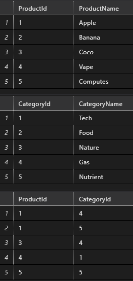

# Задание 2

В базе данных MS SQL Server есть продукты и категории. Одному продукту может соответствовать много категорий, в одной категории может быть много продуктов. Напишите SQL запрос для выбора всех пар «Имя продукта – Имя категории». Если у продукта нет категорий, то его имя все равно должно выводиться.

# Решение
``` sql
SELECT Product.ProductName, Category.CategoryName
FROM Product
LEFT JOIN ProductCategory ON Product.ProductId = ProductCategory.ProductId
LEFT JOIN Category ON Category.CategoryId = ProductCategory.CategoryId
```

### Структура таблицы
``` sql
CREATE TABLE Product
(
  ProductId INT NOT NULL PRIMARY KEY,
  ProductName VARCHAR(15)
);

CREATE TABLE Category
(
  CategoryId INT NOT NULL PRIMARY KEY,
  CategoryName VARCHAR(15)
);

CREATE TABLE ProductCategory
(
  ProductId INT,
  CategoryId INT,
  PRIMARY KEY (ProductId, CategoryId),
  FOREIGN KEY (ProductId) REFERENCES Product(ProductId),
  FOREIGN KEY (CategoryId) REFERENCES Category(CategoryId)
);
```

### Тестовые данные
``` sql
INSERT INTO Product VALUES (1, 'Apple'), (2, 'Banana'), (3, 'Coco'), (4, 'Vape'), (5, 'Computes')
INSERT INTO Category VALUES (1, 'Tech'), (2, 'Food'), (3, 'Nature'), (4, 'Gas'), (5, 'Nutrient')
INSERT INTO ProductCategory VALUES (1, 4), (1, 5), (3, 4), (4, 1), (5, 5)
```


### Результат
